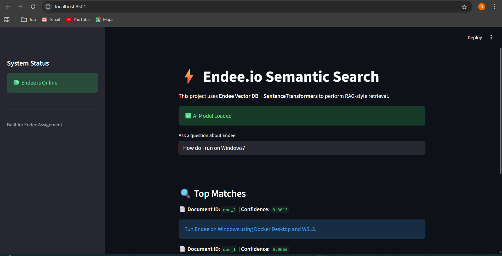

# Endee Semantic Search Engine



## 📖 Overview

This project is a high-performance **Semantic Search System** built to demonstrate the capabilities of the [Endee Vector Database](https://github.com/EndeeLabs/endee).

Unlike traditional keyword search, this application uses **vector embeddings** to understand the _meaning_ behind a user's query. It functions as the retrieval layer for a RAG (Retrieval-Augmented Generation) architecture, allowing users to query technical documentation using natural language.

### Key Features

- **Vector-Native Storage:** Utilizes Endee for efficient storage and retrieval of high-dimensional vectors.
- **Semantic Understanding:** Uses `all-MiniLM-L6-v2` to convert text into 384-dimensional embeddings.
- **Binary Performance:** Implements **MessagePack** serialization for high-speed data exchange with the C++ backend.
- **Interactive UI:** A clean Streamlit dashboard for real-time testing and visualization.

---

## 🛠️ Tech Stack

- **Database:** [Endee](https://github.com/EndeeLabs/endee) (Dockerized)
- **Backend Logic:** Python 3.10+
- **ML Model:** `sentence-transformers/all-MiniLM-L6-v2`
- **Frontend:** Streamlit
- **Protocol:** HTTP + MessagePack (`msgpack`)

---

## 🏗️ System Architecture

The project follows a standard ETL (Extract, Transform, Load) and Retrieval pattern:

1.  **Ingestion Service (`src/ingest.py`):**
    - Loads raw text documents.
    - Generates embeddings using the HuggingFace model.
    - Creates a specific index in Endee (`tech_docs`) configured for **Cosine Similarity**.
    - Uploads vectors via the REST API.

2.  **Retrieval Service (`src/search.py`):**
    - Accepts a text query from the user.
    - Vectorizes the query in real-time.
    - Requests the top `k` nearest neighbors from Endee.
    - Deserializes the binary response to rank results by confidence score.

---

## 🚀 Setup & Installation

### Prerequisites

- **Docker Desktop** (Running)
- **Python 3.10** or higher
- **Git**

### 1. Clone the Repository

```bash
git clone https://github.com/Odurukeerthan/Endee-assignment
cd endee-assignment
```

### 2. Environment Setup

- **Create a virtual environment to keep dependencies isolated:

```bash
# Windows
python -m venv venv
.\venv\Scripts\activate

# Mac/Linux
python3 -m venv venv
source venv/bin/activate
```

- **Install the required libraries:

```bash
pip install -r requirements.txt
```

### 3. Start the Database

- **Launch the Endee server using Docker Compose. This starts the service on port 8090.

```bash
docker compose up -d
```

## ⚡ Usage Guide

### Step 1: Ingest Data
- **Before searching, you must populate the database. Run the ingestion script to index the sample dataset:
```bash
python src/ingest.py
```

- *Expected Output: ✅ Index created successfully!

### Step 2: Run the Web Interface
- **Launch the Streamlit application to interact with the database:

```bash
streamlit run src/app.py
```

- **The application will open automatically at http://localhost:8501.

## 🧠 Implementation Details
### Why MessagePack?
- **Endee is optimized for SIMD and high-performance throughput. To minimize serialization overhead, it returns search results in MessagePack (binary) format rather than JSON. This project explicitly handles this by using the msgpack Python library to deserialize responses efficiently.

### Index Configuration
- **The vector index is strictly typed to match the embedding model:

- Dimensions: 384 (Matched to MiniLM-L6-v2)

- Metric: Cosine (Optimal for semantic similarity tasks)

- Engine: nmslib (For approximate nearest neighbor search)

## 📂 Project Structure

endee-assignment/
├── src/
│   ├── app.py             # Frontend UI (Streamlit)
│   ├── ingest.py          # ETL Script (Data loading)
│   └── search.py          # Core retrieval logic
├── docker-compose.yaml    # Container configuration
├── requirements.txt       # Python dependencies
├── README.md              # Project documentation
└── screenshot.png         # Proof of execution

